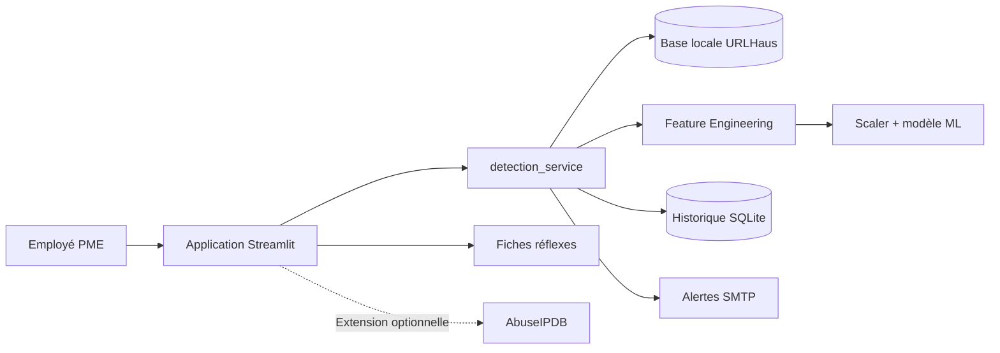

# CyberVeille PME — Détection et alerte précoce

MVP du projet PFA du CMRPI « Système de détection et d’alerte précoce des
cybermenaces ciblant les PME ». Un employé colle une URL suspecte : le système
la compare à la base locale URLHaus, l'évalue avec le modèle de régression
logistique existant, conserve l'incident dans SQLite et peut alerter le
responsable informatique par e-mail.

L'application n'ouvre jamais l'URL analysée et ne lit pas automatiquement les
boîtes Gmail ou Outlook.

## Architecture



## Organisation

- `feature_engineering.py` : extraction des caractéristiques d’une URL.
- `train_model.py` : entraînement et évaluation du modèle.
- `predict.py` : prédiction interactive sur une URL.
- `Download_urls.py` : collecte de données récentes depuis URLhaus.
- `detection_service.py` : décision centralisée URLHaus + Machine Learning.
- `database.py` : historique SQLite avec requêtes paramétrées.
- `alert_service.py` : alertes SMTP configurables et anti-doublon.
- `ip_reputation_service.py` : extension AbuseIPDB facultative.
- `app.py` : interface Streamlit pour la PME.
- `fiches_reflexes/` : trois procédures d'urgence simples.
- `tests/` : tests automatisés du MVP.
- `prepare_phishing_url_features.ipynb` : préparation et extraction des caractéristiques du jeu de données d'URL.
- `data/raw/` : jeu de données PhiUSIIL original.
- `data/processed/` : caractéristiques préparées pour l’entraînement.
- `data/collected/urlhaus/` : export URLhaus courant et historique des collectes.
- `models/` : modèle de régression logistique et scaler sauvegardés.
- `docs/` : document de cadrage, évaluation du modèle et rapport du Jalon 2.

## Installation

### Windows (PowerShell)

```powershell
python -m venv venv
.\venv\Scripts\Activate.ps1
pip install -r requirements.txt
```

Copier ensuite `.env.example` vers `.env` uniquement si les alertes ou
AbuseIPDB doivent être configurés :

```powershell
Copy-Item .env.example .env
```

### Linux / macOS

```bash
python3 -m venv venv
source venv/bin/activate
pip install -r requirements.txt
```

## Lancement du MVP

```powershell
streamlit run app.py
```

Le navigateur affiche : tableau de bord, analyse unitaire, analyse CSV,
historique, alertes, fiches réflexes et configuration.

## Pipeline de détection

1. Validation locale de l'entrée HTTP(S), sans connexion au site.
2. Recherche exacte dans `data/collected/urlhaus/current_urls.csv`.
3. Extraction des 21 caractéristiques par `extract_features()`.
4. Application du scaler et du modèle présents dans `models/`.
5. Calcul d'une probabilité estimée de phishing et d'un risque Faible, Moyen,
   Élevé ou Critique.
6. Enregistrement SQLite et alerte éventuelle.

Une URL présente dans URLHaus est classée **Critique**. Son absence dans cette
base ne prouve jamais qu'elle est légitime. Le modèle utilise la convention
existante `0 = phishing`, `1 = légitime`.

## Analyse en masse

Importer un CSV contenant une colonne `url`. Le MVP traite jusqu'à 1 000 lignes
par import, affiche un résumé et permet de télécharger les résultats. Le modèle,
le scaler et l'index URLHaus sont mis en cache pendant le traitement.

## Historique SQLite

La base `data/threats.db` est créée automatiquement et reste locale. Elle
conserve le verdict, le score, le risque, la source et l'état de l'alerte. Elle
est exclue de Git afin de ne pas publier l'historique opérationnel d'une PME.

## Configuration des alertes

Les variables suivantes sont lues depuis `.env` :

| Variable | Rôle |
|---|---|
| `ALERT_ENABLED` | Active ou désactive l'envoi |
| `ALERT_MIN_RISK` | Seuil : `Faible`, `Moyen`, `Élevé` ou `Critique` |
| `ALERT_DEDUP_MINUTES` | Fenêtre anti-doublon |
| `SMTP_HOST`, `SMTP_PORT` | Serveur SMTP |
| `SMTP_SECURITY` | `starttls`, `ssl` ou `none` |
| `SMTP_SENDER`, `SMTP_PASSWORD` | Compte d'envoi et mot de passe d'application |
| `ALERT_RECIPIENT` | Responsable informatique ou sécurité |

Les alertes sont désactivées par défaut. Un échec SMTP est journalisé sans
interrompre l'analyse. Le fichier `.env` est exclu du dépôt.

## Extension AbuseIPDB

L'analyse IP est disponible dans la page d'analyse, mais ne contacte AbuseIPDB
que si `ABUSEIPDB_API_KEY` est définie. Si la clé ou le service manque,
l'application le signale sans inventer de résultat.

## Scripts techniques

Pour entraîner le modèle :

```powershell
python train_model.py
```

Pour analyser une URL :

```powershell
python predict.py
```

Pour mettre à jour la liste provenant d’URLhaus :

```powershell
python Download_urls.py
```

Les fichiers créés sont conservés dans `data/collected/urlhaus/`. Le modèle
et le scaler entraînés sont enregistrés dans `models/`.

## Tests

```powershell
python -m unittest discover -s tests -v
```

Les tests couvrent les entrées vides et invalides, URL sans protocole, domaine
légitime, hostname IP, présence/absence URLHaus, CSV, SQLite, alertes
désactivées, échec SMTP, artefact ML absent et base URLHaus indisponible.

## Limites et perspectives

- Le résultat ML est une estimation, pas une certitude.
- Une analyse lexicale ne contrôle ni le contenu de la page ni ses redirections.
- URLHaus référence principalement des URL associées aux logiciels malveillants.
- Les données et performances doivent être surveillées dans le temps.
- L'intégration automatique Gmail/Outlook est une perspective future qui
  nécessitera des autorisations, une étude de confidentialité et des API dédiées.
- Le modèle simple est volontairement conservé : le Jalon 3 porte sur
  l'intégration et l'utilisation PME.

## Reprise du projet

- [Fonctionnement détaillé du MVP](docs/FONCTIONNEMENT_MVP_JALON3.md)
- [Liste priorisée du travail restant](docs/JALON3_A_FAIRE.md)

## Avertissement

Les fichiers de données contiennent des URL potentiellement malveillantes.
Ne les ouvrez pas dans un navigateur et ne téléchargez pas leur contenu.
