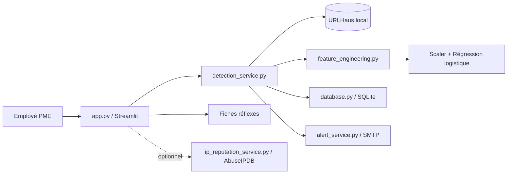

# Fonctionnement actuel du MVP — Jalon 3

Ce document permet de reprendre rapidement le projet **CyberVeille PME**.
Le MVP analyse des URL sans les ouvrir, combine une base locale de Threat
Intelligence avec un modèle de Machine Learning et conserve les résultats.

## 1. Scénario utilisateur

1. Un employé reçoit une URL suspecte.
2. Il copie l'URL sans l'ouvrir.
3. Il lance l'application Streamlit et colle l'URL.
4. Le système recherche d'abord une correspondance dans la base URLHaus locale.
5. Le système extrait ensuite 21 caractéristiques de l'URL.
6. Le scaler et la régression logistique existants produisent une estimation.
7. Le service central combine les informations et attribue un niveau de risque.
8. L'analyse est enregistrée dans SQLite.
9. Une alerte SMTP peut être envoyée si le risque atteint le seuil configuré.

## 2. Architecture



## 3. Détection centralisée

Le point d'entrée est `detection_service.analyze_url(url)`.

### Couche URLHaus

- Fichier : `data/collected/urlhaus/current_urls.csv`.
- Une correspondance exacte indique une menace connue.
- Une URL correspondante reçoit le niveau **Critique**.
- L'absence d'une URL dans URLHaus ne signifie jamais qu'elle est sûre.
- La base est chargée en mémoire et rechargée seulement si le fichier change.

### Couche Machine Learning

- Extraction : `feature_engineering.extract_features()`.
- Scaler : `models/scaler.pkl`.
- Modèle : `models/logistic_regression_model.pkl`.
- Convention vérifiée : `0 = phishing`, `1 = légitime`.
- L'ordre des 21 variables provient de `scaler.feature_names_in_`.
- Le modèle et le scaler ne sont pas réentraînés par l'application.

### Décision

Le résultat contient notamment le verdict ML, la probabilité estimée de
phishing, la correspondance URLHaus, la source, les raisons, les
recommandations et le besoin d'alerte.

| Niveau | Règle actuelle |
|---|---|
| Critique | URL présente dans URLHaus |
| Élevé | Probabilité phishing supérieure ou égale à 85 % |
| Moyen | Probabilité comprise entre 55 % et 85 % |
| Faible | Probabilité inférieure à 55 % |

Le score est une estimation statistique, pas une certitude.

## 4. Interface Streamlit

Commande de lancement :

```powershell
streamlit run app.py
```

Pages disponibles :

- **Tableau de bord** : statistiques et analyses récentes ;
- **Analyser une URL** : analyse unitaire URL et extension IP facultative ;
- **Analyse en masse** : import d'un CSV contenant une colonne `url` ;
- **Historique** : consultation et filtres SQLite ;
- **Alertes** : état de la configuration SMTP ;
- **Fiches réflexes** : actions adaptées aux PME ;
- **Configuration** : exemple des variables et limites du MVP.

Le fichier `.streamlit/config.toml` et les styles de `app.py` fournissent le
thème visuel. Ils n'affectent pas le pipeline de détection.

## 5. Historique SQLite

- Module : `database.py`.
- Base locale créée automatiquement : `data/threats.db`.
- La base est exclue de Git pour ne pas publier les incidents d'une PME.
- Les requêtes utilisent des paramètres.
- Les connexions sont fermées explicitement, y compris sous Windows.

Les informations conservées comprennent l'URL, la date, le verdict, la
probabilité, le risque, URLHaus, la source et l'état de l'alerte.

## 6. Alertes SMTP

Le module `alert_service.py` lit la configuration depuis `.env`. Les alertes
sont désactivées par défaut. Le mot de passe n'est jamais écrit dans le code.

Quand une analyse atteint le seuil configuré :

1. l'application vérifie qu'une alerte identique n'a pas été envoyée récemment ;
2. elle prépare un e-mail avec l'URL, le risque, le score et les recommandations ;
3. elle utilise SMTP avec STARTTLS ou SSL ;
4. elle enregistre le succès ou l'erreur dans SQLite ;
5. une panne SMTP ne bloque jamais l'analyse.

## 7. Collecte URLHaus

`Download_urls.py` télécharge les données récentes, nettoie les lignes,
supprime les doublons, ajoute uniquement les nouvelles URL et conserve un
historique. L'état local mémorise le hash et la date de mise à jour.

Commande manuelle :

```powershell
python Download_urls.py
```

## 8. Extension IP

`ip_reputation_service.py` interroge AbuseIPDB uniquement si
`ABUSEIPDB_API_KEY` est configurée. Sans clé ou en cas d'indisponibilité, le
service l'indique et n'invente aucun résultat. Cette extension n'est pas une
exigence principale du PFA.

## 9. Tests existants

```powershell
python -m unittest discover -s tests -v
```

Les 12 tests couvrent : validation, URL sans protocole, URL légitime, URL
suspecte avec IP, présence/absence URLHaus, CSV, SQLite, alerte désactivée,
échec SMTP, modèle absent et URLHaus indisponible.

## 10. Fichiers importants

| Fichier | Rôle |
|---|---|
| `app.py` | Interface Streamlit |
| `detection_service.py` | Orchestration de la détection |
| `database.py` | Persistance SQLite |
| `alert_service.py` | Alertes SMTP |
| `ip_reputation_service.py` | Extension AbuseIPDB |
| `feature_engineering.py` | Extraction des 21 variables |
| `Download_urls.py` | Mise à jour URLHaus |
| `.env.example` | Modèle de configuration sans secret |
| `tests/test_mvp.py` | Tests automatisés |

